# Ekya / CMR Admissions CRM — Evaluation Walkthrough

Use this document to walk the Cooper and Co test org (`org60040760589`) and write the admissions use case. Configuration lives in Zoho CRM. This folder holds the SOP screenshots and notes that were not stored as CRM records.

**SOP:** EKYA | CMR NPS | CMR NPUC | NAVA - CRM Integration  
**Document ID:** EKYA/01/26-27  
**Dept:** Admissions  
**Created:** 15-04-2025

CRM login user for this evaluation: ACP Pradhyuman (`julia.edwards+crm4e@zohotest.com`). Other active users used as campus owners: Maya Quereshi, Indravadhan Sarabhai.

---

## 1. Ticket notes that were intentionally not configured

### 1.1 IP addresses to whitelist

The Desk ticket asked for IP addresses to whitelist. **That information was not collected and was not configured on this test account.** For a Zoho CRM test / demo org this is typically not required: the evaluation users already sign in to `org60040760589`, and there is no customer firewall or production IP restriction to honour here.

If a production tenant later needs CRM, Books, or Forms restricted to campus / office networks, collect those IPs at go-live and apply them then. Do not treat missing IPs as a blocker for this evaluation.

### 1.2 Entity images

Finance / legal-entity images were empty. **No entity screenshots were invented, and no legal-entity names were invented** for Zoho Books organisations.

Campus and brand names in CRM Accounts come from SOP section 2.1 (schools and PU campuses). That is not the same as a finance legal entity. See [section 8](#8-multi-entity-books-model-from-sales-notes) for the Books subscription model from sales notes only.

### 1.3 Existing CRM picklists left untouched

This org already had EdNova-style lead and deal picklists. Those were **not overwritten**:

- Lead `Admission_Stage` (New Enquiry → Enrolled, etc.)
- Deal `Stage` (Qualification → Closed Won / Lost)

Ekya admissions uses new fields, especially **Ekya Lead Stage** (`Ekya_Lead_Stage`) on Leads and **Ekya App Stage** (`Ekya_App_Stage`) on Deals.

---

## 2. Source process flow (attached SOP / Q&A)

The images below are the screenshots provided for this evaluation. They are also stored under `docs/ekya-admissions/process-flow/`.

### 2.1 SOP cover

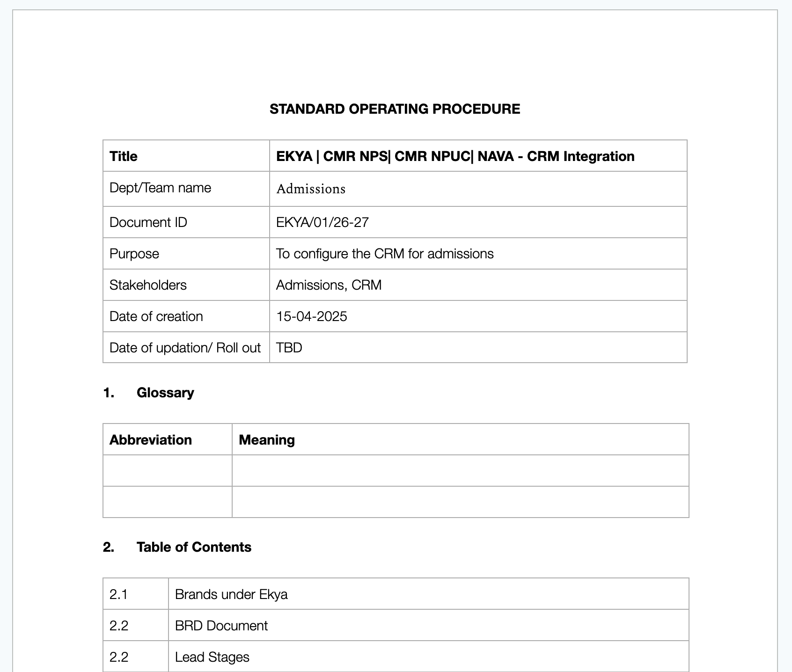

### 2.2 Glossary and table of contents

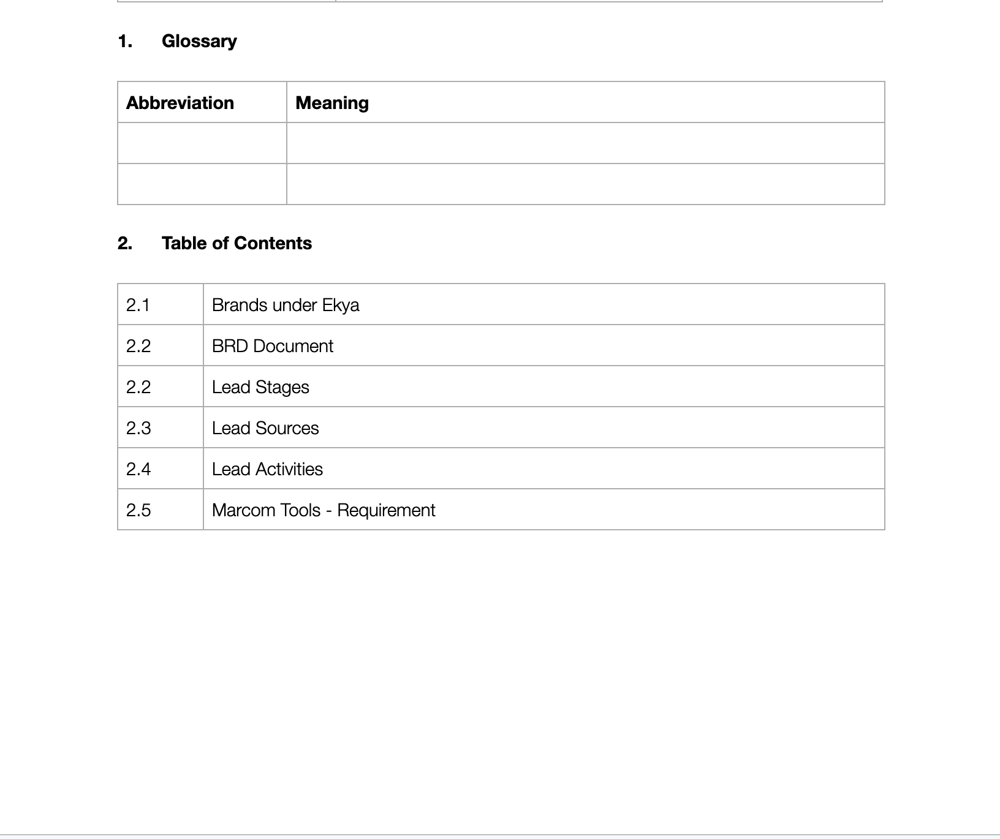

### 2.3 Brands, campuses, and lead stages

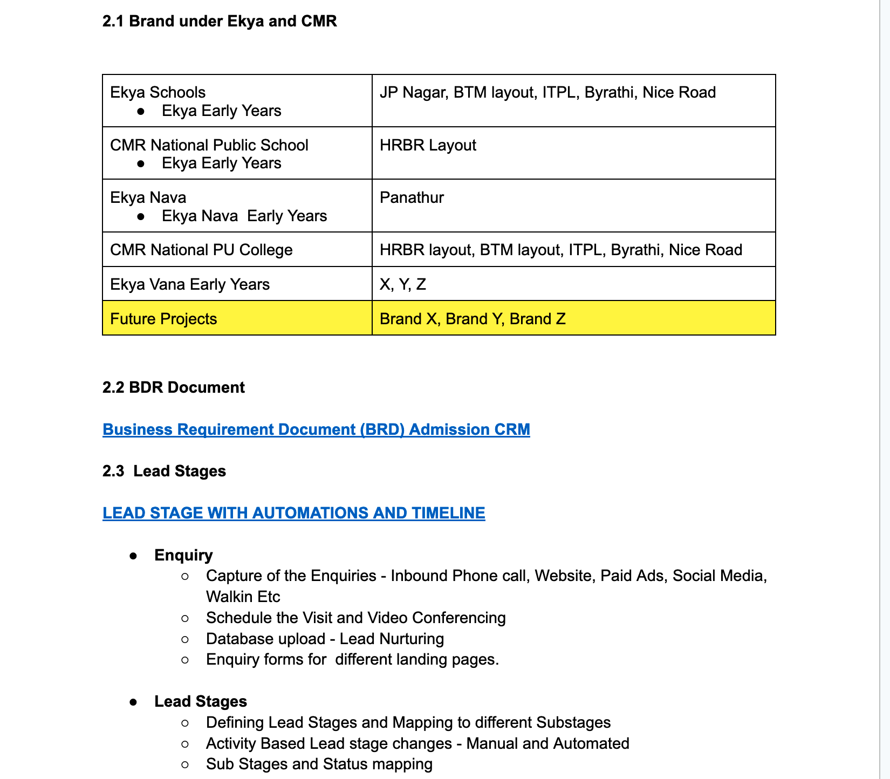

Four operating brands in Q1: **Ekya Schools, Ekya Nava, CMRNPS, CMRNPUC**. SOP 2.1 also lists Ekya Vana Early Years (campuses X, Y, Z) and future projects (Brand X / Y / Z). Those placeholders were modelled so the structure can grow without renaming modules.

| Brand | Campuses in this org |
| --- | --- |
| Ekya Schools (incl. Early Years) | JP Nagar, BTM Layout, ITPL, Byrathi, NICE Road |
| CMR National Public School (incl. Early Years) | HRBR Layout |
| Ekya Nava (incl. Nava Early Years) | Panathur |
| CMR National PU College | HRBR, BTM, ITPL, Byrathi, NICE Road |
| Ekya Vana Early Years | Campus X, Y, Z (placeholders) |

K-12 and PU admissions are different journeys. Use **App Type** `K-12` vs `PU` plus separate brand/campus accounts. Do not force PU through the K-12 pipeline.

### 2.4 Lead quality, telephony, portal, acceptance

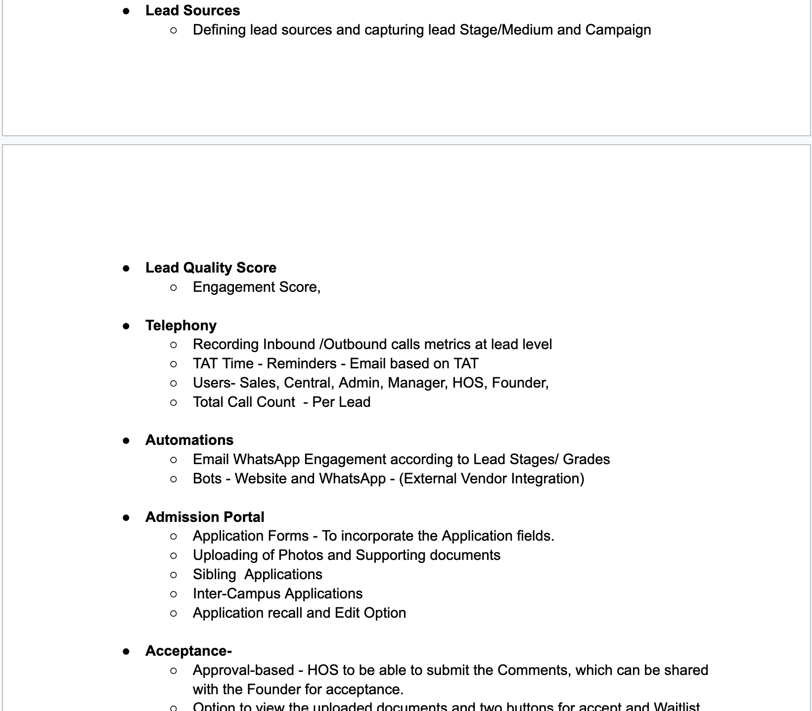

### 2.5 Lead management, user cases, reports

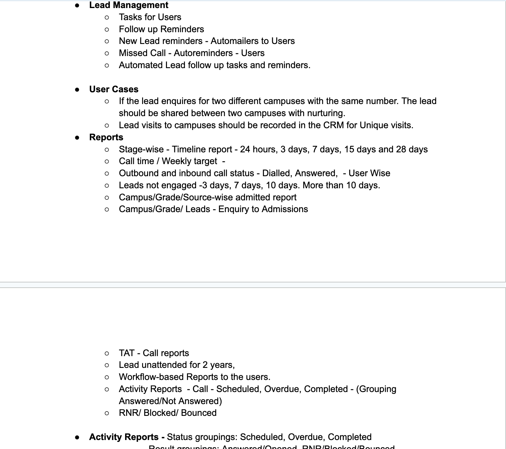

### 2.6 Activity and outcome reports

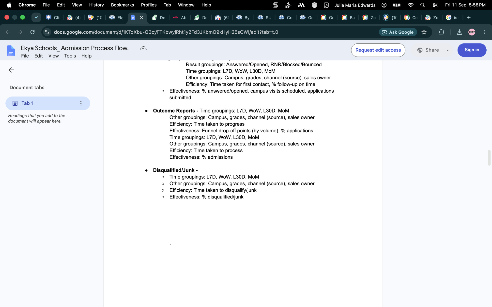

### 2.7 Campus visit booking and email / WhatsApp flow

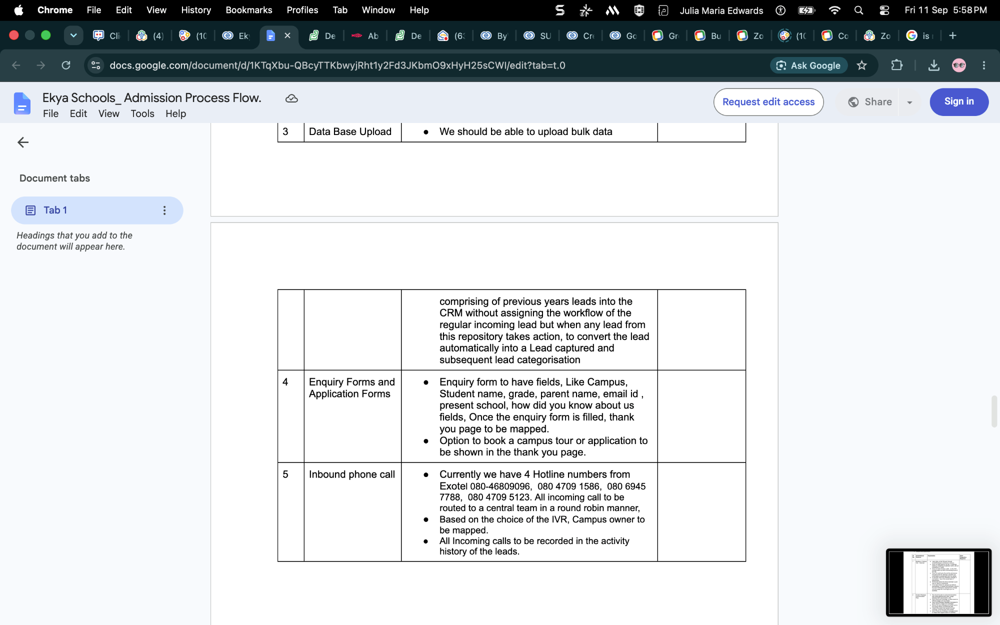

Campus visit rules modelled in CRM (live Bookings / WhatsApp not wired):

- Lead opens a booking surface with about two weeks of availability
- 30-minute slots in working hours
- Confirmation to admissions and the lead
- Reminder 1 day before (email + WhatsApp in production)
- Reminder 30 minutes before, with reschedule
- Missed without reschedule → missed reminder, stage / sub-stage reassignment, nurture

### 2.8 Enquiry forms and inbound phone

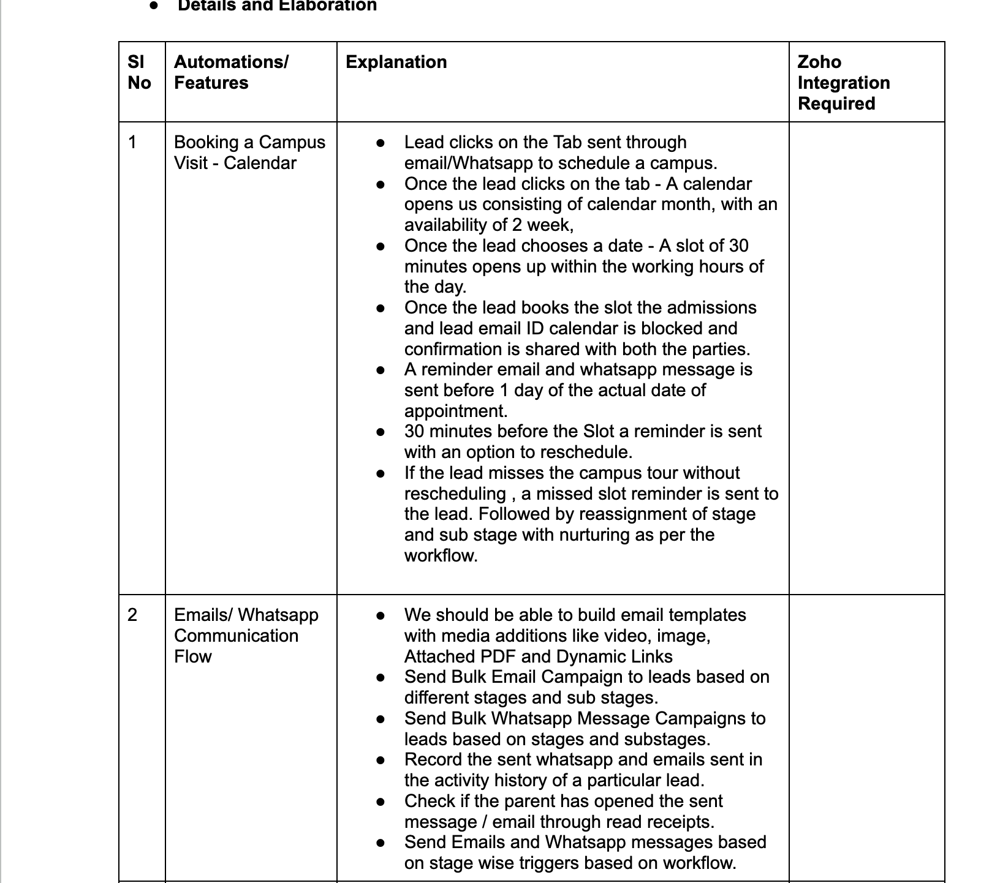

Enquiry form fields from the SOP: Campus, student name, grade, parent name, email, previous school, how did you know about us. Thank-you page should offer **book a campus tour** or **start an application**.

Inbound hotlines (round-robin to a central team; IVR maps campus owner):

- 080-46809096
- 080 4709 1586
- 080 6945 7788
- 080 4709 5123

### 2.9 Preliminary Q&A — brands, portal, stages

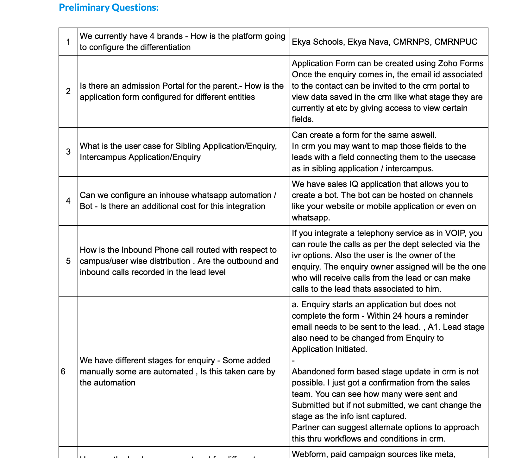

### 2.10 Preliminary Q&A — automations, IVR, pipelines

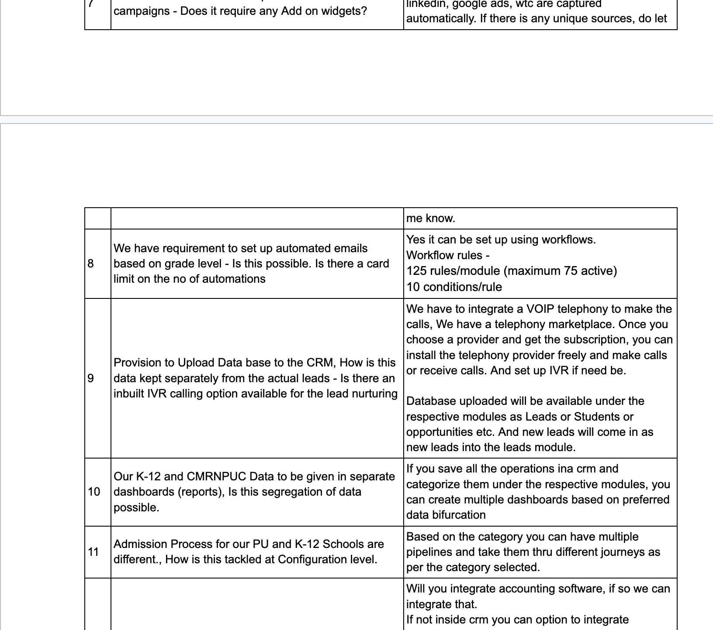

### 2.11 Preliminary Q&A — payments, forms, booking

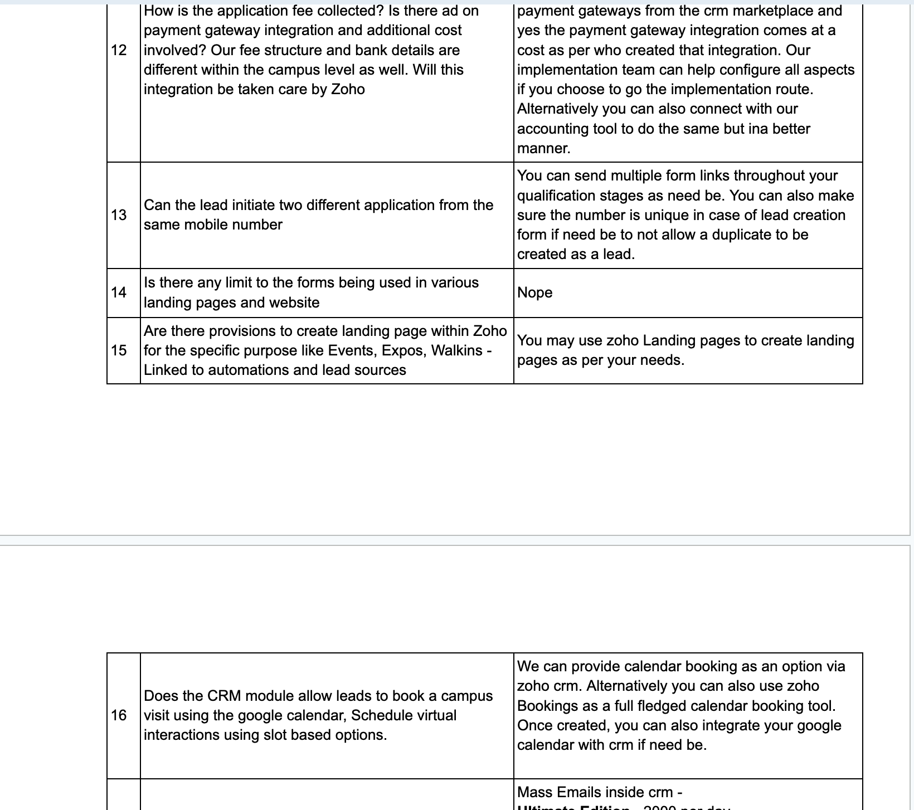

### 2.12 Preliminary Q&A — consumables and OTP

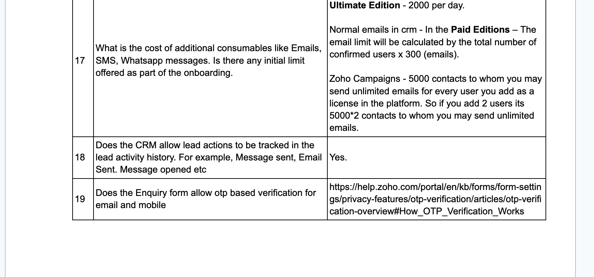

---

## 3. How to walk the CRM (15 minutes)

Filter Leads on **Brand Ekya** is not empty. Ignore the older EdNova `Admission_Stage` field; use **Ekya Lead Stage**.

### Step A — Same mobile, two campuses (Q13 / user case)

Search phone **9876543210**.

| Parent | Student | Campus | Stage | Lead ID |
| --- | --- | --- | --- | --- |
| Anita Sharma | Aarav Sharma | Ekya JP Nagar | Enquiry | `902823000002043006` |
| Anita Sharma | Diya Sharma | Ekya BTM Layout | App Initiated | `902823000002043007` |

This is allowed. Mobile was **not** made a unique duplicate block. Each campus keeps its own lead and can be nurtured separately.

### Step B — Sibling and intercampus enquiry (Q3)

| Parent | Flag | Campus | Stage | Lead ID |
| --- | --- | --- | --- | --- |
| Kavya Reddy / Vihaan Reddy | Sibling Enquiry = true | CMRNPS HRBR | Enquiry | `902823000002043008` |
| Meera Iyer / Ananya Iyer | Intercampus Enq = true | Nava Panathur | Enquiry | `902823000002043009` |

### Step C — Abandoned form / 24-hour reminder (Q6)

Open **Suresh Nair / Nila Nair** (`902823000002043010`).

- Ekya Lead Stage: **App Initiated**
- Form Status: **Abandoned**
- Related task: `24h incomplete application reminder - Nila Nair` (`902823000002042005`)

**Sales caveat (do not over-claim):** abandoned-form stage update from Zoho Forms into CRM is not natively possible. Partners can approximate it with workflows after a form event is captured. This sample is a CRM-side illustration, not a live Forms webhook.

### Step D — Campus visit booked vs missed (SOP automation 1)

**Booked:** Priya Menon / Arjun Menon (`902823000002043011`)

- Stage **Visit Scheduled**, Visit Status **Booked**
- Visit Date **18 Sep 2026 10:00 IST** (30-minute event `902823000002022016`)
- Tasks: day-before reminder (`902823000002042006`) and 30-minute reminder with reschedule (`902823000002042007`)
- Workflow **Ekya Visit Day Before** marks Visit Status **Reminder Sent** at 10:00 IST the day before a Booked visit

**Missed:** Rohit Das / Ishaan Das (`902823000002043012`)

- Stage **Visit Missed**, Visit Status **Missed**
- Visit Date **10 Sep 2026**
- Event `902823000002022017` and nurture task `902823000002042008`

Setting Visit Status to **Missed** on a live lead fires **Ekya Visit Missed Stage**.

### Step E — Application submitted through founder decision

| Parent / student | Stage | What to notice | Lead ID |
| --- | --- | --- | --- |
| Farah Khan / Zara Khan | App Submitted | Form Status Submitted, visit Attended | `902823000002043013` |
| Lakshmi Rao / Aditi Rao | HOS Review | HOS Comments filled, Founder Decision Pending | `902823000002043014` |
| Neha Patel / Kabir Patel | Waitlist | Founder Decision Waitlist, capacity note | `902823000002043015` |
| Sanjay Mehta / Aanya Mehta | Accepted | Founder Decision Accept, OTP Verified | `902823000002030010` |

Acceptance path from the SOP: HOS comments shared with Founder; view uploaded documents; **Accept** and **Waitlist** as founder outcomes. Document upload / parent portal is **not** live in this org. Changing Founder Decision to **Accept** on a lead fires **Ekya Founder Accept Stage**.

Related deals (standard Deal Stage left as Qualification):

| Deal | ID |
| --- | --- |
| K-12 Application - Zara Khan - CMRNPS HRBR | `902823000002021147` |
| PU Application - Kiran Gowda - NPUC HRBR | `902823000002021148` |
| K-12 Accepted - Aanya Mehta - Ekya ITPL | `902823000002021149` |

### Step F — PU vs K-12, database upload, inbound phone

| Scenario | Record | Stage | Lead ID |
| --- | --- | --- | --- |
| PU journey (different pipeline) | Ramesh Gowda / Kiran Gowda, App Type PU, PUC 1, NPUC HRBR | App Initiated | `902823000002030007` |
| Prior-year database, no incoming-lead workflow until action | Amit Banerjee / Riya Banerjee, How Heard = Database Upload | Enquiry | `902823000002030008` |
| Inbound hotline + call count | Maria Joseph / Leo Joseph, Hotline `080-46809096`, Call Count 1 | Enquiry | `902823000002030009` |

### Step G — Org tree (Accounts)

Open **Ekya \| CMR Group** (`902823000002022001`). Child brand accounts and campus accounts sit under it via Parent Account. Campus owners are Maya or Indravadhan so assignment / reporting can be split by campus.

---

## 4. Fields added for this evaluation

Labels are truncated to Zoho’s 25-character custom-field limit.

### Leads

| Label | API name | Role |
| --- | --- | --- |
| Brand Ekya | `Brand_Ekya` | Ekya Schools, Ekya Nava, CMRNPS, CMRNPUC, Ekya Vana EY |
| Campus Ekya | `Campus_Ekya` | Campus picklist (brand-prefixed values) |
| Grade Applied | `Grade_Applied` | Nursery–Grade 12, PUC 1, PUC 2 |
| Student Name | `Student_Name` | Child name (parent is Last Name) |
| Previous School | `Previous_School` | Enquiry form |
| How Heard | `How_Heard` | Website, Meta, LinkedIn, Google Ads, Walk-in, Inbound Phone, etc. |
| Sibling Enquiry | `Sibling_Enquiry` | Boolean |
| Intercampus Enq | `Intercampus_Enq` | Boolean |
| App Type | `App_Type` | K-12 or PU |
| Ekya Lead Stage | `Ekya_Lead_Stage` | Admissions journey (see below) |
| Lead Sub Stage | `Lead_Sub_Stage` | Free text sub-stage |
| Visit Status | `Visit_Status` | Not Booked, Booked, Reminder Sent, Attended, Missed, Rescheduled |
| Form Status | `Form_Status` | Started, Submitted, Abandoned |
| Founder Decision | `Founder_Decision` | Pending, Accept, Waitlist |
| HOS Comments | `HOS_Comments` | Shared with founder |
| Visit Date | `Visit_Date` | Datetime for reminders |
| Hotline Number | `Hotline_Number` | Four published numbers |
| OTP Verified | `OTP_Verified` | Flag only; no live OTP |
| Call Count | `Call_Count` | Telephony metric stand-in |
| Engagement Score | `Engagement_Score` | Quality-score stand-in |

**Ekya Lead Stage values:** Enquiry → App Initiated → Visit Scheduled → Visit Missed → App Submitted → Review → Readiness Session → HOS Review → Founder Review → Accepted / Waitlist / Disqualified / Junk.

### Accounts

`Org_Node_Type` (Group / Brand / Campus), `Brand_Ekya`, `Campus_Ekya`, `App_Type`, `Hotline_Number`.

### Deals

`Brand_Ekya`, `Campus_Ekya`, `Grade_Applied`, `App_Type`, `Ekya_App_Stage`, `Founder_Decision`, `HOS_Comments`, `Student_Name`.

---

## 5. Workflows in this org

All names start with **Ekya**. The existing **EdNova follow -up update** rule was not changed.

| Rule | ID | When | Action |
| --- | --- | --- | --- |
| Ekya Set Stage Enquiry | `902823000002040006` | Lead create, Brand Ekya not empty | Stage = Enquiry |
| Ekya Form Started Stage | `902823000002026007` | Form Status = Started | Stage = App Initiated |
| Ekya Form Submitted Stage | `902823000002021131` | Form Status = Submitted | Stage = App Submitted |
| Ekya Visit Day Before | `902823000002040014` | Visit Date −1 day at 10:00 IST, Visit Status = Booked | Visit Status = Reminder Sent |
| Ekya Visit Missed Stage | `902823000002020082` | Visit Status = Missed | Stage = Visit Missed |
| Ekya Founder Accept Stage | `902823000002021140` | Founder Decision = Accept | Stage = Accepted |

**Demo note:** creating a lead with Brand Ekya always lands on Enquiry first, even if you send a later stage on create. Re-set the stage after create (or skip connected workflows) when seeding samples.

WhatsApp, drip-by-grade mailers, and 30-minute-before visit messages are represented as **tasks** on the sample leads, not as live Campaigns / Bookings / SalesIQ bots.

---

## 6. What this test org cannot demonstrate live

Configure or partner-integrate these in production. Sample flags and tasks only show where they would attach.

| Requirement | Why it is not live here |
| --- | --- |
| IP whitelist | Not required for this test account; see section 1.1 |
| Zoho Forms + OTP for email/mobile | Needs Forms + privacy OTP; CRM has `OTP_Verified` only. Reference: [OTP verification overview](https://help.zoho.com/portal/en/kb/forms/form-settings/privacy-features/otp-verification/articles/otp-verification-overview#How_OTP_Verification_Works) |
| Parent admission portal | CRM portal / customer portal not provisioned on this org |
| WhatsApp / SalesIQ bot | External / SalesIQ; extra cost per Q4 |
| VOIP, IVR, call recording | Marketplace telephony after the customer picks a provider |
| Payment gateway + campus-specific bank details | Marketplace gateway; campus fee structures differ (Q12) |
| Zoho Bookings / Google Calendar two-way | Bookings not set up; Events + Visit Date used instead |
| Zoho Campaigns bulk email / WhatsApp | Consumable limits from Q17; not subscribed for this demo |
| Abandoned form from Forms | Sales confirmation: native CRM stage update on abandon is not available |
| Document upload + Accept / Waitlist buttons on a portal | HOS / Founder fields only |
| Separate K-12 vs CMRNPUC dashboards | Data is tagged (`App_Type`, brand, campus) so reports can be built; analytics views were not published |

---

## 7. Consumable limits (from Q17 — for the use-case write-up)

Quoted from the sales Q&A, not verified against this test org’s licence:

- Mass email inside CRM, Ultimate Edition: 2000 per day
- Paid editions: confirmed users × 300 emails
- Zoho Campaigns: 5000 contacts per licensed user; emails to those contacts unlimited on that model

---

## 8. Multi-entity Books model (from sales notes)

Do **not** create or name Zoho Books organisations from empty entity images.

Sales guidance captured for the use case:

- One Books organisation can sit under Zoho One
- Remaining legal entities need **standalone Books subscriptions**
- Warehouses / bins apply only when storage locations belong to the **same** legal entity
- Payment gateway integration is a paid marketplace add-on; campus-level fee and bank details must be configured per entity / campus, not assumed identical
- Accounting can be implemented by the Zoho implementation team or connected to an accounting product; CRM is not a substitute for multi-entity books

Until legal-entity names and GST / bank packs are provided, keep finance out of this CRM demo. Campus Accounts are operational locations, not finance entities.

---

## 9. Suggested use-case outline

When writing the customer use case, map CRM objects as follows:

1. **Lead** = parent enquiry / application in progress (student name on the lead)
2. **Account** = group / brand / campus (not a finance entity)
3. **Deal** = application being progressed toward admission
4. **Event** = campus visit slot
5. **Task** = counsellor reminder (24h form, day-before visit, 30-min visit, missed nurture)
6. **Ekya Lead Stage** = admissions journey; leave `Admission_Stage` for the existing EdNova process

Keep K-12 and PU as parallel journeys (`App_Type`). Allow the same phone on multiple leads. Do not unique-block mobile.

---

## 10. Case Study record in CRM

| Field | Value |
| --- | --- |
| Module | Case_Study |
| Name | Ekya CMR Admissions Evaluation |
| Record ID | `902823000002022024` |
| Status | Drafted |
| Customer name | Contact Ekya Admissions Evaluation (`902823000002022021`), related to Account Ekya \| CMR Group |
| Insight | Summary of this walkthrough (attach this file in the CRM UI Document field if you need the screenshots on the record) |
