# Copy this into Zoho Show Zia

Zia’s box is **text only** (2,500 characters). It cannot hold JPEG files. This page is the workaround:

1. Copy the prompt.
2. Generate the deck.
3. Drop the images below onto the `[IMG]` slides.

---

## 1. Open Generate

Zoho Show → **Generate a presentation using Zia** → **Describe your presentation idea**.

## 2. Set these first

| Setting | Choose |
| --- | --- |
| Slide Limit | **Largest** (not Small) |
| Content Tone | Professional |
| Visual Style | **Content with Placeholders** |
| Theme | Basic or Executive |

## 3. Copy the prompt (2,497 / 2,500)

Open [zia-generate-prompt.txt](zia-generate-prompt.txt) → Select all → Copy → paste into the box.

```
Professional 16:9 CRM demo. Sparse slides, large titles. Do not reorder. Scene slides start with CRM OPEN. After each [IMG] make a full-slide image placeholder.

Title: Connected admissions across four brands and every campus
Subtitle: Ekya Schools · Ekya Nava · CMR NPS · CMR NPUC · 20-min live demo

1 Title
2 Order: 0:00 four brands; 1:30 same phone two campuses; 4:00 sibling/intercampus; 6:00 phone, database, abandoned form; 9:00 visit booked/missed; 12:00 submit→HOS→waitlist/accept; 16:00 PU vs K-12; 17:30 workflows; 19:00 close
3 Watch Ekya Lead Stage (ignore Admission Stage). Do not edit showcase records. Parking lot: portal, WhatsApp, IVR, payments, Bookings, OTP
4 Scene 0 — Four brands, one CRM. Campuses under brands. K-12 ≠ PU. CRM OPEN: Accounts → Ekya | CMR Group
5 Table: Ekya Schools JP Nagar/BTM/ITPL/Byrathi/NICE (K-12); CMR NPS HRBR (K-12); Nava Panathur (K-12); CMR NPUC HRBR/BTM/ITPL/Byrathi/NICE (PU); Vana X,Y,Z
6 [IMG] 05-sop-brands-campuses.jpg
7 Journey: Enquiry → App Initiated → Visit Scheduled/Missed → App Submitted → HOS Review → Founder Review → Accepted/Waitlist
8 Scene 1 — Anita Sharma: Aarav JP Nagar Enquiry; Diya BTM App Initiated. Do not unique-lock mobile. CRM OPEN: 9876543210
9 [IMG] 07-crm-two-campus.jpg
10 Scene 2 — Sibling Reddy CMRNPS HRBR LKG. Intercampus Iyer Nava from JP Nagar. CRM OPEN: Reddy then Iyer
11 Scene 3 — Joseph inbound 080-46809096; Banerjee database; Nair abandoned form + 24h task. CRM OPEN: Joseph → Banerjee → Nair
12 [IMG] 11-sop-forms-inbound.jpg
13 Scene 4 — Menon booked 18 Sep 2026 10:00 Byrathi. Das missed 10 Sep NICE; Visit Status=Missed fires workflow. CRM OPEN: Menon then Das
14 [IMG] 13-sop-campus-visit.jpg
15 Scene 5 — Khan App Submitted; Rao HOS pending; Patel Waitlist; Mehta Accepted. Do not edit founder live. CRM OPEN: Khan → Rao → Patel → Mehta
16 Scene 6 — PU ≠ K-12. Gowda CMRNPUC HRBR PUC 1 vs Khan K-12 deal. CRM OPEN: Gowda + Deals
17 Scene 7 — Workflows: Set Stage Enquiry; Form Started; Form Submitted; Visit Day Before; Visit Missed; Founder Accept. Skip EdNova. CRM OPEN: Workflow Rules → Ekya
18 Scene 8 — Go-live: Forms OTP, portal, Bookings, WhatsApp, telephony, campus payments; Books: one Zoho One org, others standalone
19 [IMG] 18-sop-portal-telephony.jpg
20 Questions: two apps one phone; sibling vs intercampus; K-12 vs PU; missed visit; HOS to founder
21 Searches: 9876543210, Reddy, Iyer, Nair, Menon, Das, Khan, Rao, Patel, Mehta, Gowda, Banerjee, Joseph
22 [IMG] 21-sop-reports.jpg
```

Then **Generate Presentation**.

Do not copy this markdown file into Zia — only the prompt above (or the `.txt`). Do not copy Python.

## 4. Insert these images onto the `[IMG]` slides

Download [Ekya-CMR-Admissions-Screenshots.zip](Ekya-CMR-Admissions-Screenshots.zip) and unzip. Do not insert from the GitHub file preview.

Click the placeholder on that slide → **Insert image** → pick the matching `.jpg`.

### Slide 6 — `05-sop-brands-campuses.jpg`

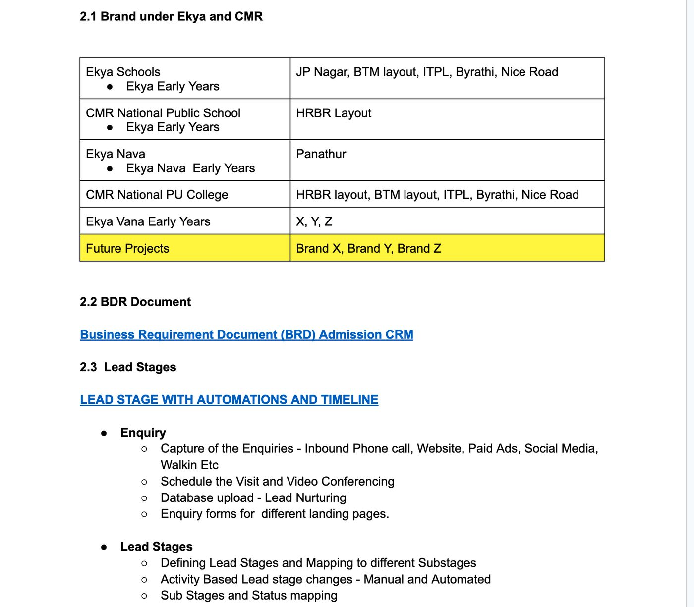

### Slide 9 — `07-crm-two-campus.jpg`

Replace with a live CRM capture of Leads search `9876543210` before the call.

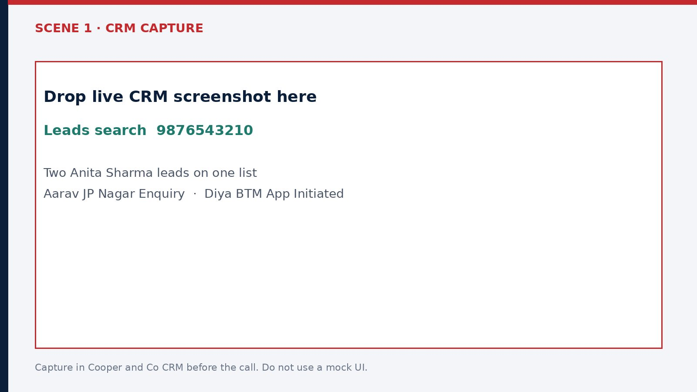

### Slide 12 — `11-sop-forms-inbound.jpg`

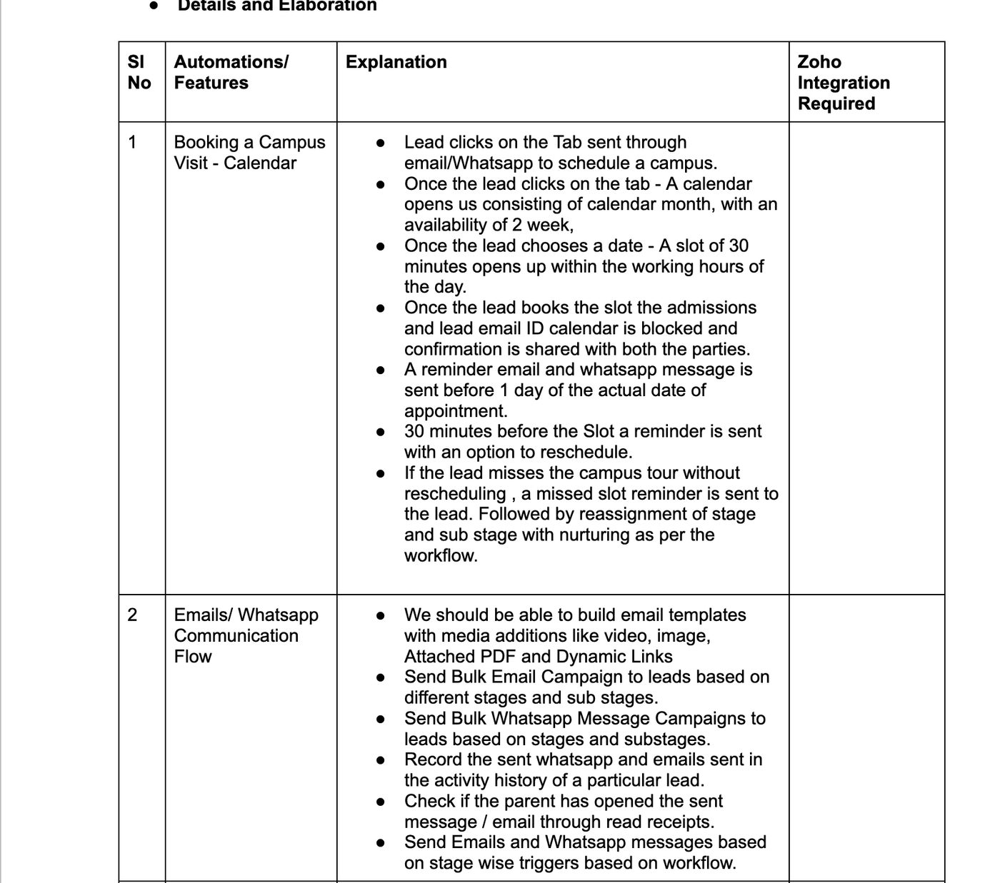

### Slide 14 — `13-sop-campus-visit.jpg`

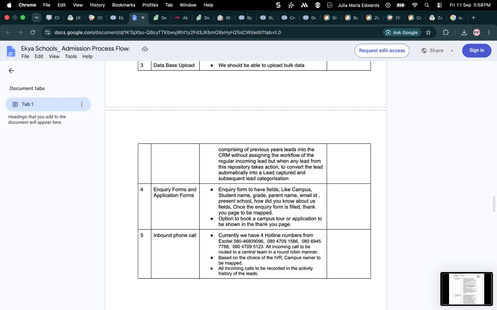

### Slide 19 — `18-sop-portal-telephony.jpg`

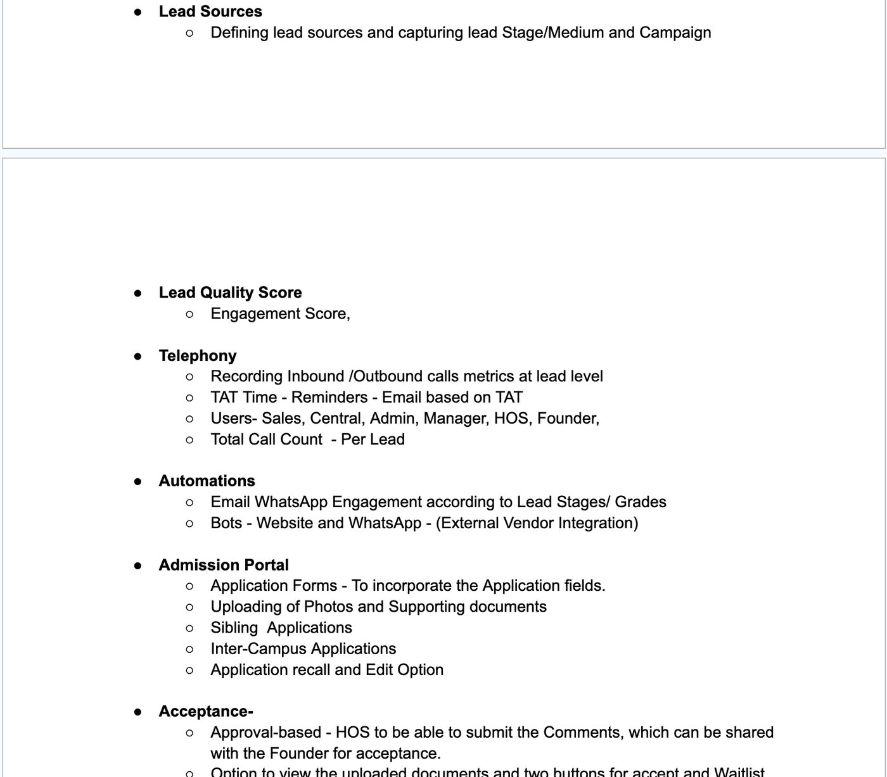

### Slide 22 — `21-sop-reports.jpg`

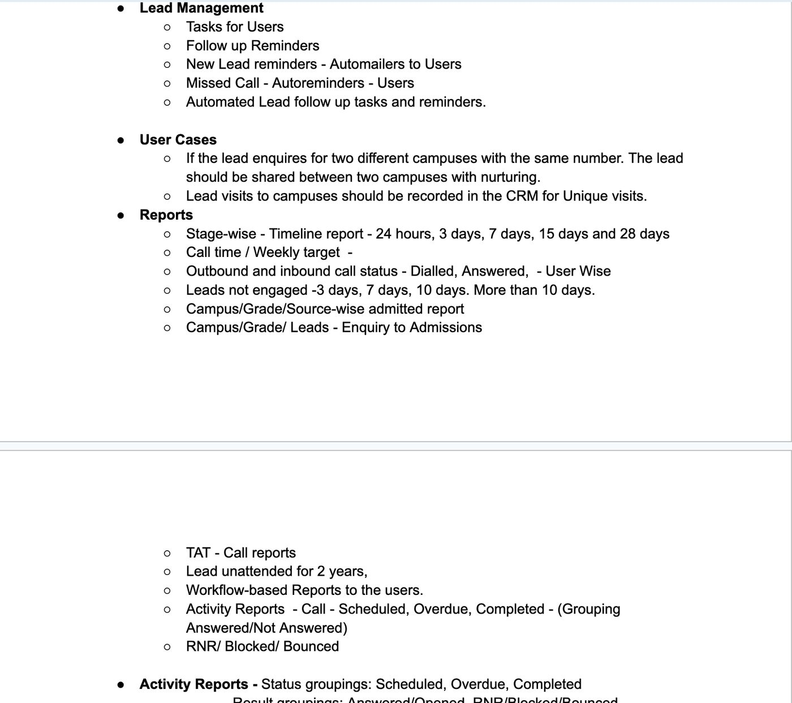

## Extra CRM frames (optional)

Drop these onto the matching scene slides if you want a still as well as the live click.

| Slide | File | Search |
| ---: | --- | --- |
| 10 Scene 2 | `08-crm-sibling.jpg` | Reddy |
| 10 Scene 2 | `08b-crm-intercampus.jpg` | Iyer |
| 11 Scene 3 | `11-crm-nair.jpg` | Nair |
| 13 Scene 4 | `13-crm-menon.jpg` | Menon |
| 13 Scene 4 | `13b-crm-das.jpg` | Das |
| 15 Scene 5 | `14-crm-mehta.jpg` | Mehta |
| 17 Scene 7 | `16-crm-workflows.jpg` | Workflow Rules → Ekya |

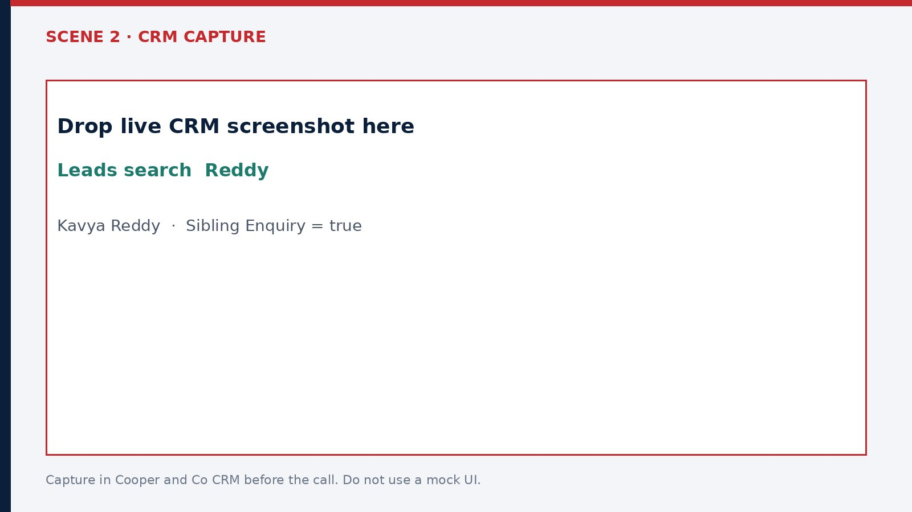


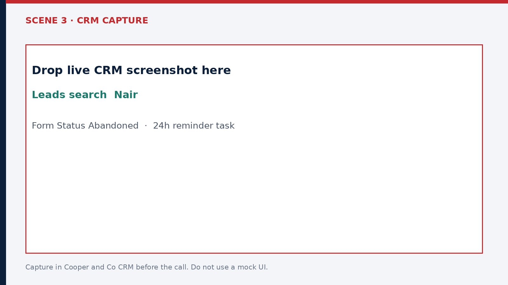

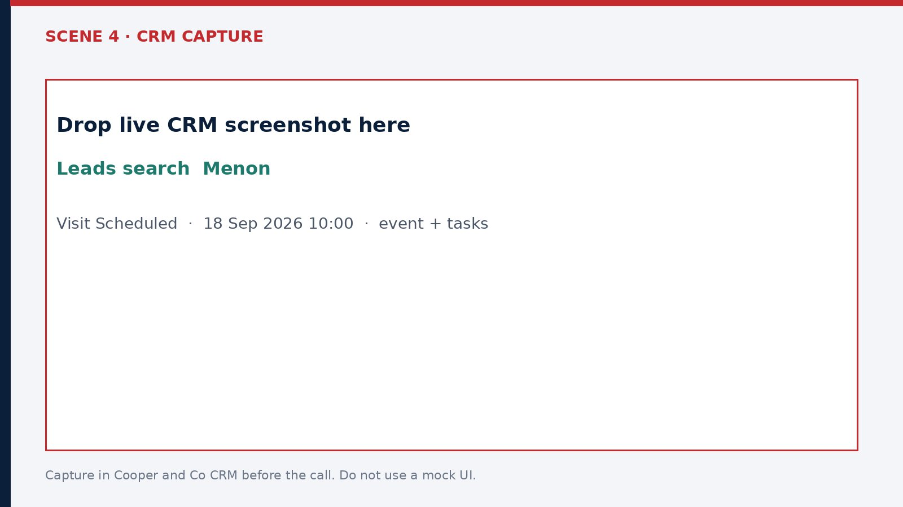

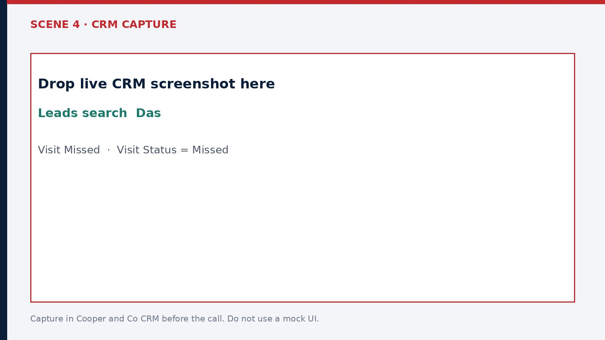

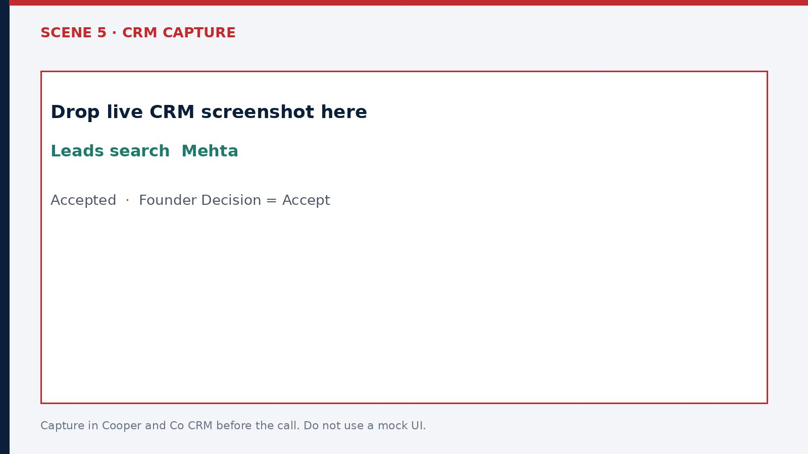

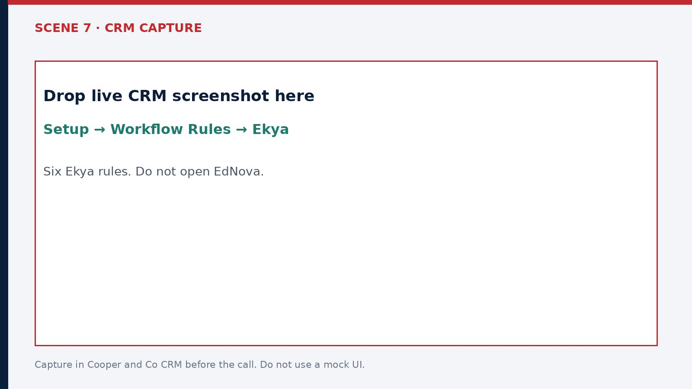
